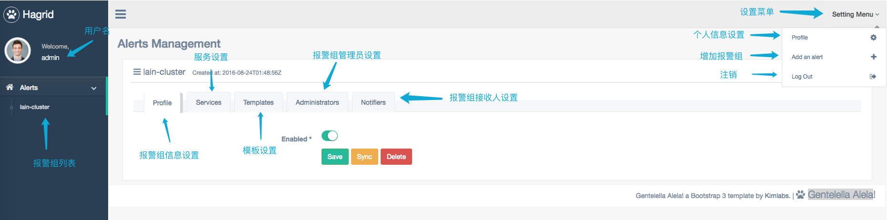

# 主界面

Hagrid 主界面如下图

主界面主要分为3部分

- 左侧报警组列表：点击 `alert`，可以列出所有当前用户具有管理权限的报警组。点击某一个报警组，中间会列出该报警组的管理界面。
- 中间报警组管理分为5大模块：
    - 报警组信息管理：主要是维护报警组的激活状态，以及同步或删除报警组。点击 `Profile` 可以进入报警组信息管理页面。
    - 服务管理：主要是维护报警组中服务的信息，添加服务以及删除服务。点击 `Services` 可以进入服务管理页面。
    - 模板管理：主要是维护报警组中模板的信息，添加模板以及删除模板。点击 `Templates` 可以进入模板管理页面。
    - 报警组管理员管理：主要是添加或删除报警组的管理员。点击 `Administrators` 可以进入管理员管理页面。
    - 报警组接收人管理：主要是添加或删除报警组的接收人。点击 `Notifiers` 可以进入接收人管理页面。
- 右侧设置菜单：
    - 个人信息设置：维护当前用户的联系信息。点击 `Profile` 可以弹出个人信息维护页面。
    - 增加报警组：增加新的报警组。点击 `Add an alert` 可以弹出增加报警组页面。
    - 注销：登出系统。
