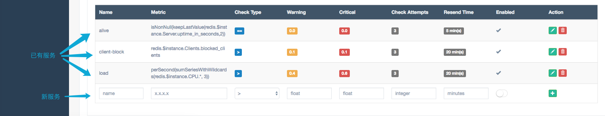

# 服务管理

服务管理页面如下图

在服务管理页面中，用户可以查看、修改、删除已有服务，或添加新服务。

该表格中各项属性描述如下

|属性|描述|
|:-:|:-:|
|Name|服务的名称，在同一个报警组中需要唯一。|
|Metric|服务的指标的 [graphite-api](http://graphite.readthedocs.io/en/latest/functions.html) 函数。可以使用`$`指定**至多一个**变量，该变量的取值范围可以在[模板管理](s5.html)中设置。常用的表达式请见本节末尾。|
|Check Type|触发报警时，指标的比较条件，取值范围是大于(`>`)、小于(`<`)、等于(`==`)、不等于(`!=`)。|
|Warning|触发 Warning 的报警阈值，浮点数。该报警会发送 bearychat 和邮件。|
|Critical|触发 Critical 的报警阈值，浮点数。该报警会发送 bearychat、邮件和短信|
|Check Attempts|触发报警时指标的检查次数。即如果指定为3，则连续3次满足报警条件后，就会触发报警。每次检查间隔固定为1分钟。|
|Resend Time|发送报警的时间间隔，整型，单位为分钟。|
|Enabled|该项报警服务是否处于激活状态。|

为了便于使用，在输入服务指标时，Hagrid会自动提示较常用的函数表达式，包括了节点的CPU、内存、磁盘、文件系统以及网络等方面。

常用的表达式如下

- CPU 相关

|描述|指标|指标含义|变量含义|单位|
|:-:|:-:|:-:|:-:|:-:|
|User CPU usage(%) [0-100]|averageSeriesWithWildcards($node.cpu.*.percent.user, 2)|用户态 CPU 使用量|节点的 hostname|百分比|
|System CPU usage(%) [0-100]|averageSeriesWithWildcards($node.cpu.*.percent.system, 2)|系统态 CPU 使用量|节点的 hostname|百分比|
|Load longterm [0+]|$node.load.load.relative.longterm|longterm CPU 使用率|节点的 hostname|百分比|
|Load shortterm [0+]|$node.load.load.relative.shortterm|shortterm CPU 使用率|节点的 hostname|百分比|
|Contexts' switching(times/min) [0+]|$node.contextswitch.contextswitch|每分钟的上下文切换次数|节点的hostname|次数每分钟|

- 内存相关

|描述|指标|指标含义|变量含义|单位|
|:-:|:-:|:-:|:-:|:-:|
|Memory usage(%) [0-100]|$node.memory.percent.used|内存使用量|节点的 hostname|百分比|
|Swap usage(%) [0-100]|$node.swap.percent.used|Swap 使用量|节点的 hostname|百分比|

- 网络相关

    > 需要指定网卡（即将 `<interface_name>` 替换为相应的网卡名称）。

|描述|指标|指标含义|变量含义|单位|
|:-:|:-:|:-:|:-:|:-:|
|Network rx(bytes/min) [0+]|$node.interface.<interface_name>.if_octets.rx|网卡接收速率|节点的 hostname|字节每分钟|
|Network tx(bytes/min) [0+]|$node.interface.<interface_name>.if_octets.tx|网卡发送速率|节点的 hostname|字节每分钟|

- 磁盘相关

    > 列举了较为常用的磁盘分区名称，如果有其他磁盘请做适当的替换。

|描述|指标|指标含义|变量含义|单位|
|:-:|:-:|:-:|:-:|:-:|
|/dev/xvda1 I/O utils(%) [0-100]|asPercent($node.disk.dev_xvda1.disk_io_time.io_time, 1000)|磁盘分区 /dev/xvda1 的吞吐量|节点的 hostname|百分比|
|/dev/xvda2 I/O utils(%) [0-100]|asPercent($node.disk.dev_xvda2.disk_io_time.io_time, 1000)|磁盘分区 /dev/xvda2 的吞吐量|节点的 hostname|百分比|
|/dev/xvdb1 I/O utils(%) [0-100]|asPercent($node.disk.dev_xvdb1.disk_io_time.io_time, 1000)|磁盘分区 /dev/xvdb1 的吞吐量|节点的 hostname|百分比|
    
- 文件系统相关

    > 列举了较为常用的挂载点（根分区和 data），如果有其他挂载点请做适当的替换。

|描述|指标|指标含义|变量含义|单位|
|:-:|:-:|:-:|:-:|:-:|
|File descriptors used [0+]|$node.fhcount.file_handles.used|文件描述符使用量|节点的 hostname|个|
|/ used(%) [0-100]|$node.df.root.percent_bytes.used|根分区使用率|节点的 hostname|百分比|
|/ data(%) [0-100]|$node.df.data.percent_bytes.used|data 分区使用率|节点的 hostname|百分比|