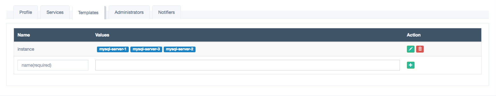

# 模板管理 

在实际应用中，如果需要给多台机器配置同样的报警规则，这时通过模板管理并结合服务管理中的变量，就可以实现批量生成报警服务。

模板管理界面如下图

在模板管理中，要求模板名在同一个报警组中要唯一。一个模板变量可以有多个取值，在同步该报警组后，Hagrid会自动将值依次替换到应用到该变量的服务中。

如图中所示，如果设置了一个报警服务，Metric 为 `$instance.memory.percent.used`，
则在同步后，会生成以下三个报警服务:

- mysql-server-1.memory.percent.used
- mysql-server-2.memory.percent.used
- mysql-server-3.memory.percent.used